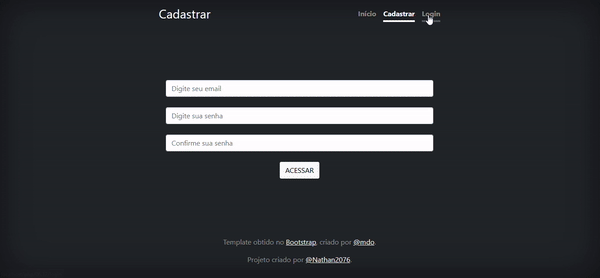

<h1 align="center">CadastroPHP</h1>

  

 

## Sobre

Uma página de cadastro e login com ligação a banco de dados usando PHP. A conexão será feita em uma atividade futura.

## Tecnologias Utilizadas

- ✅ PHP
- ✅ JS
- ✅ HTML
- ✅ CSS
- ✅ Bootstrap
